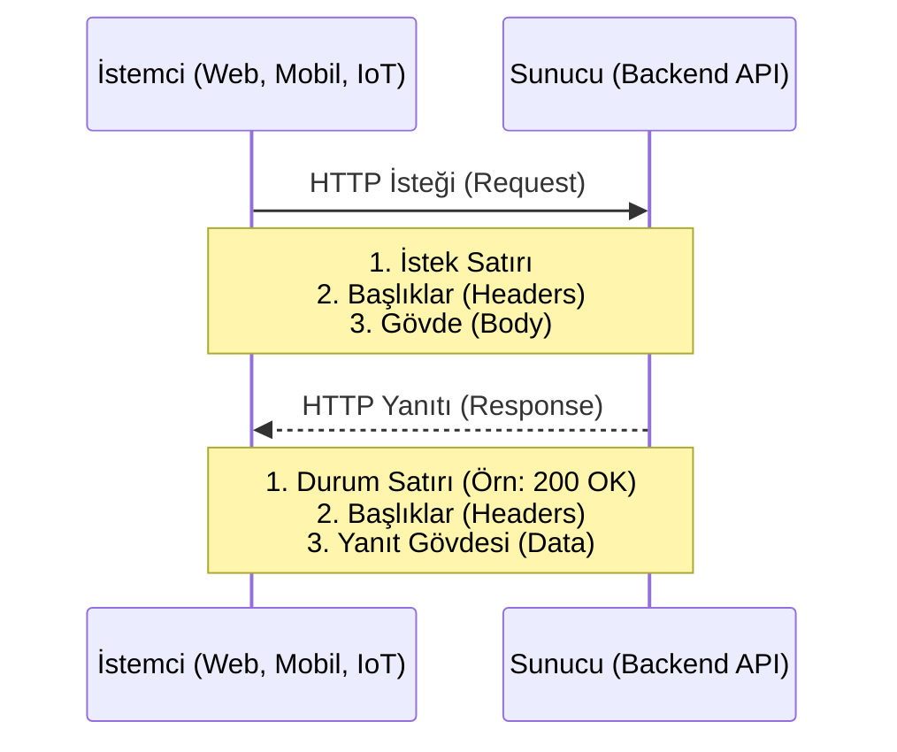
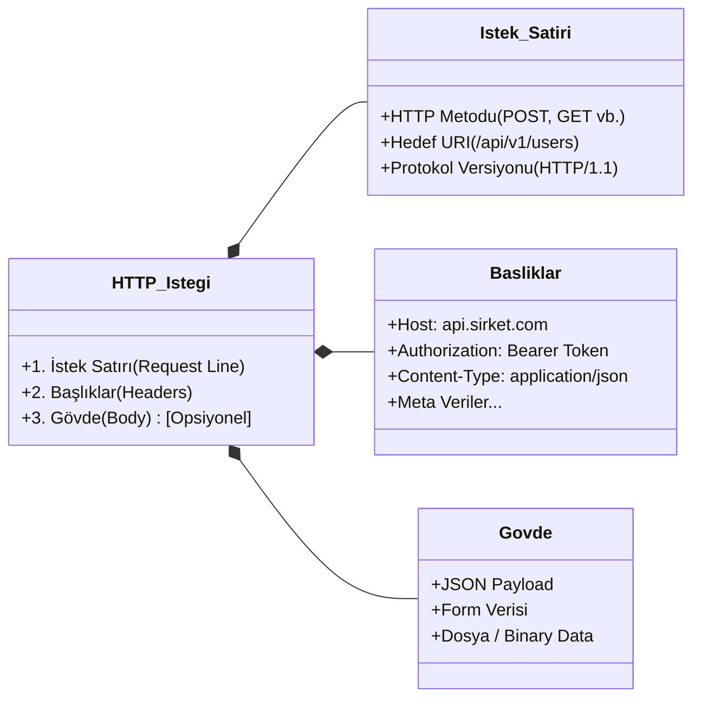

# Bir HTTP İsteğinin Anatomisi

Modern backend mimarilerinde (özellikle mikroservisler, serverless yapılar ve RESTful API'lerde), istemci (client) ile sunucu (server) arasındaki iletişimin temel taşı HTTP istekleridir. Sağlam ve ölçeklenebilir sistemler tasarlayabilmek için HTTP'nin altında yatan yapıyı tam olarak anlamak kritik öneme sahiptir.

## İstemci ve Sunucu İletişim Akışı

Her şey istemcinin bir bağlantı başlatmasıyla başlar. Aşağıdaki şema, bu standart istek-yanıt (request-response) döngüsünü göstermektedir:



---

## İsteğin Yapısal Anatomisi

Bir HTTP isteği temel olarak üç ana bölümden oluşur. Aşağıdaki hiyerarşik şemada bu bileşenlerin alt detaylarını görebilirsiniz:



---

### 1. İstek Satırı (Request Line)
İsteğin kalbidir. Ne yapılmak istendiğini, nereye yapılmak istendiğini ve hangi protokolün kullanıldığını tek bir satırda belirtir. 

`[HTTP Metodu] [İstek URI'si] [HTTP Versiyonu]`

**Örnek:** `POST /api/v1/users?type=admin HTTP/1.1`

* **HTTP Metodu (Method/Verb):** İşlemin niyetini belirler. (Örn: Veri çekmek için `GET`, oluşturmak için `POST`, güncellemek için `PUT`/`PATCH`, silmek için `DELETE`).
* **URI (Uniform Resource Identifier):** İşlem yapılacak kaynağın yoludur (Endpoint). Sorgu parametrelerini (Query string) içerebilir.
* **Versiyon:** Kullanılan HTTP protokolünün versiyonudur (Genellikle `HTTP/1.1` veya `HTTP/2`).

### 2. İstek Başlıkları (Request Headers)
İstemci, istenen kaynak veya isteğin kendisi hakkında meta veriler taşır. Key-Value (Anahtar-Değer) formatında alt alta sıralanırlar. Doğru header yönetimi, güvenli ve esnek mimarilerin olmazsa olmazıdır.

**Önemli Başlıklar:**
* **`Host`**: İsteğin gönderildiği sunucunun domain adıdır.
* **`Accept`**: İstemcinin yanıt olarak anlayabileceği veri tipleridir.
* **`Content-Type`**: İstek bir Gövde içeriyorsa, bu verinin formatını belirtir.
* **`Authorization`**: Kimlik doğrulama için kullanılır (örn. JWT taşımak).
* **`X-Forwarded-For`**: Load Balancer arkasından gelen isteği yapan asıl istemcinin gerçek IP'sini taşır.

### 3. İstek Gövdesi (Request Body)
Her HTTP isteğinde bulunmak zorunda değildir (`GET` isteklerinde genellikle bulunmaz). `POST`, `PUT` gibi sunucuya veri gönderilmesi gereken durumlarda asıl veriyi (payload) taşır.

**Örnek (JSON payload):**
```json
{
  "username": "dev_engineer",
  "email": "dev@example.com",
  "preferences": {
    "theme": "dark"
  }
}
```

---

## Birleştirilmiş Ham HTTP İsteği

Tüm parçaları bir araya getirdiğimizde, network katmanında ham bir HTTP isteği tam olarak şöyle görünür:

```http
POST /api/v1/auth/login HTTP/1.1
Host: api.sirketiniz.com
Content-Type: application/json
Accept: application/json
Authorization: Bearer a1b2c3d4e5...

{
  "username": "admin",
  "password": "securepassword123"
}
```